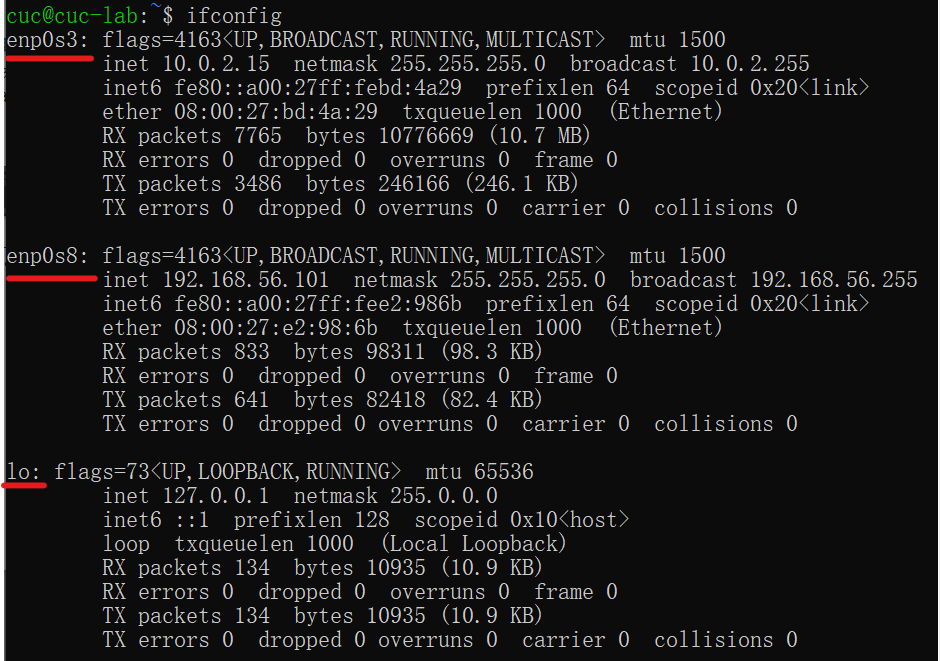
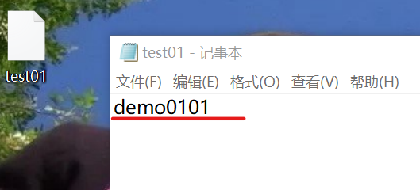

# 第一章实验报告

## 实验目的

 主流 Linux 发行版初体验：本地实验环境和云实验环境

## 实验环境

本地虚拟机Virtualbox Ubuntu20.04

阿里云 云上实践平台 CentOS版本

## 实验步骤

### 1.调查并记录实验环境的如下信息：

- #### 当前 Linux 发行版基本信息

  - Ubuntu

    `lsb_release -a`
    
    
    
    `cat /etc/issue`
    
    	
    
    `cat /etc/os-release`
    
    
    
    

- CentOS

  `lsb_release -a`

  

  `cat /etc/issue`

  

  `	cat /etc/os-release`

  

- #### 当前 Linux 内核版本信息

  - Ubuntu

    `uname -a`

    

  - CentOS

    `uname -a`

    

### 2.Virtualbox 安装完 Ubuntu 之后新添加的网卡如何实现系统开机自动启用和自动获取 IP？

- 搜索Ubuntu相关网卡设置，选择使用 `ifconfig`口令，没有找到`ifconfig`

  

  查找发现需要预先安装工具包，于是安装 `sudo apt install net-tools`

  

  再次 `ifconfig`，发现已经有三个网卡了

  

  打开网络配置的文件查看一下

  ubuntu20网络的配置信息不再保存在`/etc/network/interfaces`文件中，新系统使用`netplan`管理网络

  对于配置信息，使用`vim`打开文件`sudo vim /etc/netplan/00-installer-config.yaml`，内容如下

  

  果然已经存在`enp0s8: dhcp4:true` 了，但是不知道这是什么时候设置的

  回想，貌似自己之前根据同学在第一章答疑区的问题，加上老师的建议已经修改了网络设置如图，不知是否与此有关

  并且最初安装虚拟机时，我的Ubuntu虚拟机就是无法开启新任务，当时将问题在网络上搜索后发现需要设置网络为内部网络，随之成功。

  后来修改回NAT也突然成功了，却并没有深究其中原理呢（这两个应该是有关的吧，不然我也不知道怎么解释了）

  

  退出vim，输入`:q!`成功退出

  

### 3.如何使用 `scp` 在「虚拟机和宿主机之间」、「本机和远程 Linux 系统之间」传输文件？

HW老师演示了本机和远程系统间文件的传输，故先从这个开始

- #### 本机和远程 Linux 系统之间

  - 远程向本机

    - 传输文件

      在CentOS中根目录创建test01文件

      

      在cmd中连接gitbash

      

      `cd Desktop`切换到桌面目录

      `scp root@xxx.xxx.xxx.xxx:/root/xxx ./`拷贝文件到当前目录

      

      check，文件传输成功

      

    - 传输文件夹

      CentOS根目录中

       `mkdir test01-dir`创建test01-dir文件夹，并在其中创建多个文件

      

      `scp -r root@xxx.xxx.xxx.xxx:/root/xxx ./`拷贝文件夹到`desktop`，记住一定加 `-r`

      

      check成功

      

  - 本机向远程（操作同上，过程简化）

      `scp xxx root@xxx.xxx.xxx.xxx:/root/`向CentOS根目录传输文件

    

    check ，目录中原本没有此文件，传输后可以查询到，成功

    

- #### 虚拟机和宿主机之间

  - 虚拟机向宿主机传递

    登陆虚拟机，在`/home/cuc/`目录下创建test02文件和test02-dir文件夹

    

    在本机gitbash上操作`scp` test02，test02-dir

    

    check Desktop，成功

    

  - 宿主机向虚拟机传输文件

    在虚拟机中删除test02文件，test02-dir文件夹

    `rm -rf xxx/`

    

    在宿主机Desktop目录中找到刚接收的文件`scp`传输到虚拟机中

    

    check，虚拟机目录中可以查找到，成功

    

### 4.如何配置 SSH 免密登录？

- gitbash环境中

   `ssh-keygen.exe`生成密钥（这需要打码吗？浅打一下吧）

  

  `ssh-copy-id -i ~/.ssh/id_rsa.pub XXX@XXX.XXX.XXX.XXX`

  连接本地虚拟机，如果要连接CentOS版本是一个道理

  

  check一下，成功啦

  

## 实验中遇到的问题与总结

- 中间一度因为在cmd中无法使用ctrl+c，ctrl+v来复制粘贴，不知道怎么操作但是需要输入的口令太长而抓狂。

  搜索教程的时候也没弄清楚环境，全是针对vim编辑器环境中的，导致问题没法解决，后来就开始摆烂乱按，误触了右键却直接粘贴成功了才发现不能使用ctrl+v来粘贴但是直接按右键就可以了。。真是。。。不幸中的万幸

- vim编辑器我就成为了那个新手笑话，，怎么都退出不来，讲过还是忘了，又只能搜索教程

- 在CentOS与本机gitbash传输文件的时候遇到问题，使用`scp`命令传输文件时显示`permission denied`

  

  查看教程使用`chmod -R 777 /root`也没用，怎么搞都不行

  

  耗了快半小时云平台使用时间不够了只能结束重开，在新环境中重头再来一遍，就莫名其妙成功了，一模一样的操作（我认为一模一样，因为我输了很多遍都不行，在新环境第一次就成功了，当然可能是因为操作不一样但是我确实没看出来)

  现在我都没明白这个问题到底为什么出现又怎么解决了，因为出现突然结束也突然。。希望师哥师姐如果知道可以为我解答一下

- 用GitBash配置了免密登陆之后好像把之前的密钥覆盖了，导致仓库无法`git clone`

  

  找到`C:\Users\86132\.ssh`目录下`id-rsa.pub`文件复制到`new key`生成新`ssh key`后成功

  

- 使用了Typora的点击图片插入，导致全部是绝对路径，知道应该使用相对路径于是每次使用都将前面的路径删除了，万万没想到绝对路径和相对路径的斜杠方向好像是反的，在本地可以显示，push到GitHub上之后就全部无法显示了，于是再次修改全部图片，记住了，这次把默认设置改成优先使用相对路径了

  

- 上传到GitHub，发现图片有些能看有些不能看见，就不是网络问题，询问老师后排除了因为文件后缀大小写，中英文字符，markdown缩进导致的显示问题，只能够将成功图片与问题图片一一对比，最后发现成功图片都没有空格，于是发现命名有空格的图片无法显示，终于找到问题所在

  

- 回头来看这次作业其实并不困难，每个问题课上都演示过了，但这这也只是掌握后回想中的轻松，实际上在做的时候压力真的太大了。ddl，一头雾水的专有名词，晦涩难懂的命令，每次总是意想不到的地方卡BUG。当然最要命的绝对是自己幻想的困难给自己带来的无穷压力，别人老早做完的作业自己总原地打转，自我否定，永远不会忘记在咖啡馆欲哭无泪的那个下午。。

  但我还是完成了这次作业，虽不完美，由此告诫自己，不说对真正无力面对的困难而屈服的情况，至少不能被想象中的困难所打败，花多一点时间，慢慢的研究，不做比较，一遍不行就两遍，什么东西都会有弄明白的一天吧。我的学习之路不能是一帆风顺的话，希望最后也能豁然开朗。

## 参考链接

- [2022-03-07 第3次直播答疑完整回放](http://courses.cuc.edu.cn/course/82669/learning-activity/full-screen#/249100)
- [ubuntu20添加新网卡后设置自动启用并获取ip](https://blog.csdn.net/xiongyangg/article/details/110206220)
- [Ubuntu系统中找不到ifconfig命令](https://blog.csdn.net/qq_36938617/article/details/95013583)

- [Linux vi/vim](https://www.runoob.com/linux/linux-vim.html)