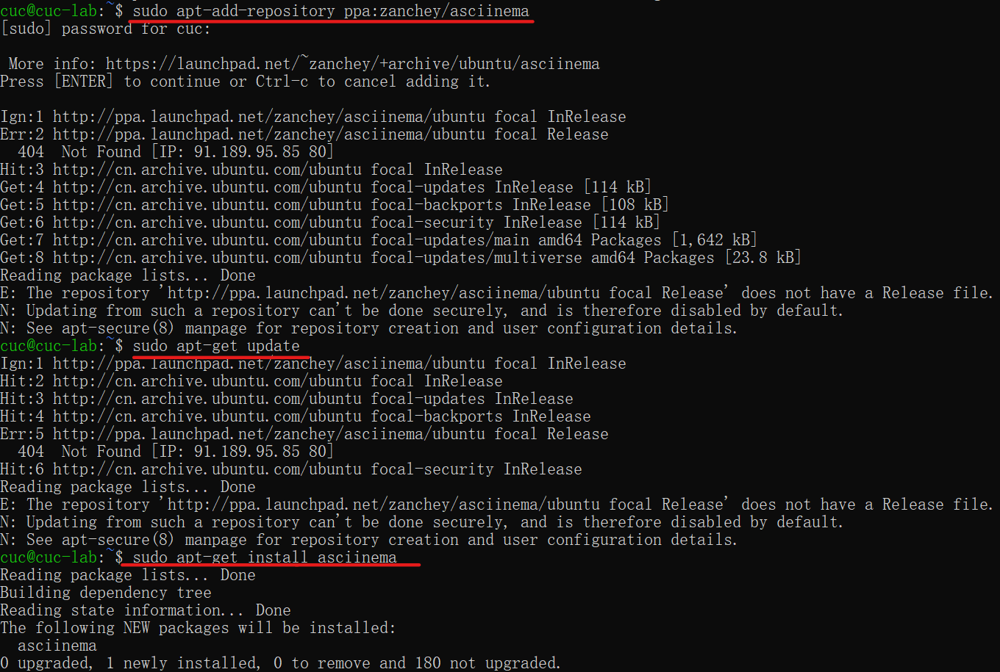
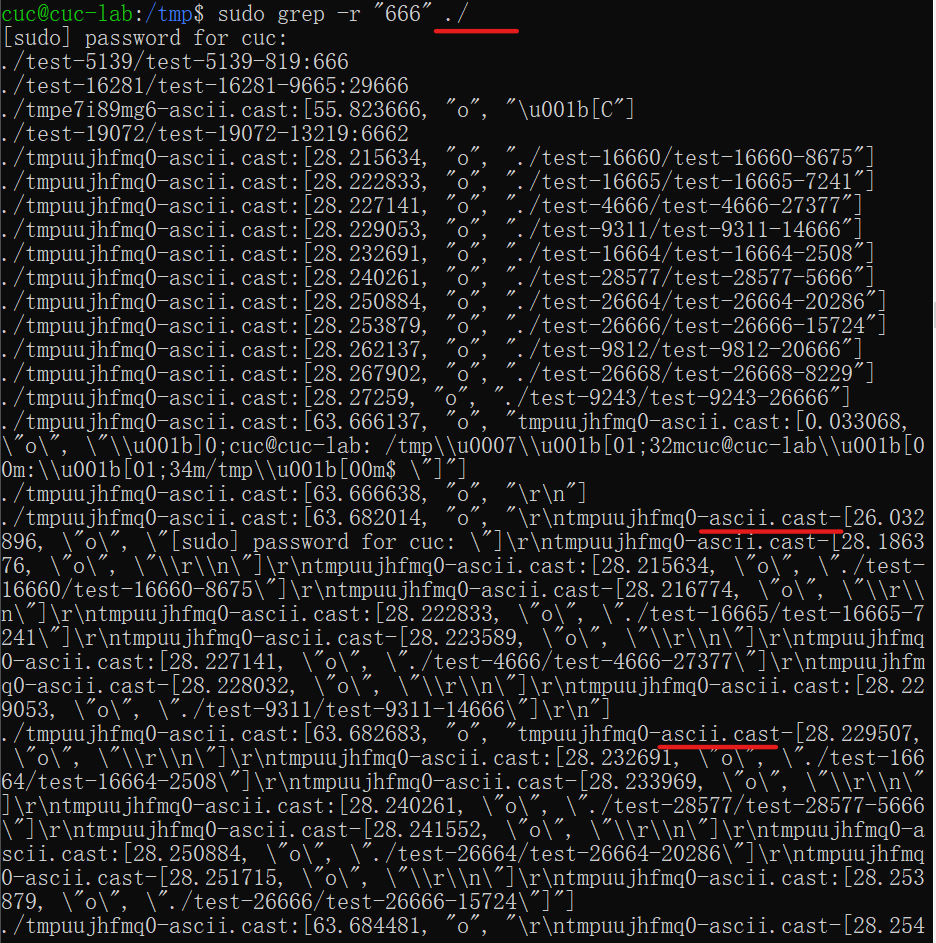
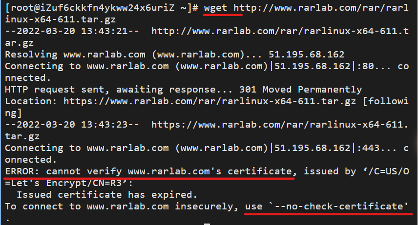
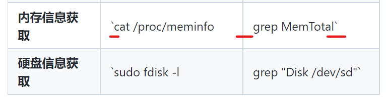

# 第二章实验报告

## 实验目的

Linux命令行使用基础：本地实验环境和云实验环境

## 实验环境

- 当前课程推荐的 Linux 发行版本
  - 本地环境（Ubuntu）
  - 云环境（CentOS）

- 在[asciinema](https://asciinema.org/)注册一个账号，并在本地安装配置好`asciinema`

  

## 实验要求

- 使用表格方式记录至少 2 个不同 Linux 发行版本上以下信息的获取方法，使用 [asciinema](https://asciinema.org/) 录屏方式「分段」记录相关信息的获取过程和结果

- 【软件包管理】在目标发行版上安装 `tmux` 和 `tshark` ；查看这 2 个软件被安装到哪些路径；卸载 `tshark` ；验证 `tshark` 卸载结果

- 【文件管理】复制以下 `shell` 代码到终端运行，在目标 Linux 发行版系统中构造测试数据集，然后回答以下问题：

  - 找到 `/tmp` 目录及其所有子目录下，文件名包含 `666` 的所有文件

  - 找到 `/tmp` 目录及其所有子目录下，文件内容包含 `666` 的所有文件

    ```
    cd /tmp && for i in $(seq 0 1024);
    do dir="test-$RANDOM";
    mkdir "$dir";
    echo "$RANDOM" > "$dir/$dir-$RANDOM";
    done
    ```

- 【文件压缩与解压缩】练习课件中 [文件压缩与解压缩](https://c4pr1c3.github.io/LinuxSysAdmin/chap0x02.md.html#/12/1) 一节所有提到的压缩与解压缩命令的使用方法

- 【跟练】 [子进程管理实验](https://asciinema.org/a/f3ux5ogwbxwo2q0wxxd0hmn54)

- 【硬件信息获取】目标系统的 CPU、内存大小、硬盘数量与硬盘容量

## 实验步骤

使用表格方式记录至少 2 个不同 Linux 发行版本上以下信息的获取方法，使用 [asciinema](https://asciinema.org/) 录屏方式「分段」记录相关信息的获取过程和结果

1. ### 【软件包管理】在目标发行版上安装 `tmux` 和 `tshark` ；查看这 2 个软件被安装到哪些路径；卸载 `tshark` ；验证 `tshark` 卸载结果

   - Ubuntu

     ```
     #更新apt
     sudo apt update 
     #安装软件包
     sudo apt install tmux 
     sudo apt install tshark
     #查找依赖关系
     apt-cache depends tmux
     #查看所创建目录文件
     dpkg -L tmux 
     apt-cache depends tshark
     dpkg -L tshark
     #删除tshark软件包，配置文件
     sudo apt purge tshark 
     #查证tshark是否还存在
     dpkg -L tshark 
     which tshark
     ```

     [](https://asciinema.org/a/ibAUkajhnM0OABFd7jLMaYT8k)

   - CentOS

     ```
     #安装tmux
     yum install tmux 
     #查询安装路经
     rpm -qal|grep tmux 
     #安装tshark，发现没有此安装包
     yum install tshark 
     #查询后发现tshark包含在wireshark中
     yum install wireshark 
     rpm -qal|grep wireshark
     #卸载wireshark
     yum remove wireshark 
     #检查
     which wireshark 
     ```

     [](https://asciinema.org/a/3AAxEmo0wsbJM2eNKNPHEHy4A)

2. ### 【文件管理】复制以下`shell`代码到终端运行，在目标 Linux 发行版系统中构造测试数据集，然后回答以下问题：

   - ```
     cd /tmp && for i in $(seq 0 1024);
     do dir="test-$RANDOM";
     mkdir "$dir";
     echo "$RANDOM" > "$dir/$dir-$RANDOM";
     done
     ```

   - #### 找到 `/tmp` 目录及其所有子目录下，文件名包含 `666` 的所有文件

   - #### 找到 `/tmp` 目录及其所有子目录下，文件内容包含 `666` 的所有文件

     - Ubuntu

       ```
       #查找文件名包含666
       sudo find ./ -type f -name "*666*" 
       #查找文件内包含666，发现乱码
       sudo grep -r "666" ./ 
       #查询资料，需将asciinema录制文件*.cast排除在外
       sudo grep -r "666" ./ --exclude=*.cast 
       ```

       [](https://asciinema.org/a/Oxi3DrzCmRe17vtruoQgszKGs)

     - CentOS

       ```
       #查找文件名包含666
       find ./ -type f -name "*666*" 
       #查找文件内包含666
       grep -r "666" ./ --exclude=*.cast 
       ```

       [](https://asciinema.org/a/qGBT7k5XkFsWVa7C7L0o5NDVQ)

3. ### 【文件压缩与解压缩】练习课件中 [文件压缩与解压缩](https://c4pr1c3.github.io/LinuxSysAdmin/chap0x02.md.html#/12/1) 一节所有提到的压缩与解压缩命令的使用方法

   - Ubuntu

     ```
     #提前安装好所需软件包
     sudo apt install zip
     sudo apt install p7zip
     sudo apt install p7zip-full
     sudo apt install rar
     sudo apt install unrar
     ```

     ```
     #gzip压缩，解压
     gzip test.txt 
     gzip -dv test.txt.gz 
     #bzip2压缩，解压
     bzip2 test.txt 
     bzip2 -d test.txt.bz2
     #zip压缩，解压
     zip test.zip test.txt
     unzip test.zip
     #tar压缩，解压
     tar -czf test.tar.gz test.txt
     tar -xzf test.tar.gz
     #7z (p7zip)压缩，解压
     p7zip test.txt 
     7z x test.txt.7z
     #rar 压缩，解压
     rar a test.rar test.txt 
     unrar e test.rar
     ```

     [](https://asciinema.org/a/YmbhCnkHspfwtQXk4P3u91Uol)

   - CentOS

     ```
     #提前安装好软件包，与Ubuntu安装略有不同
     yum -y install bzip2
     yum -y install unzip
     #查询资料发现默认Centos7没有安装p7zip安装包，默认源里面也没有这个安装包，需要安装epel源才能安装p7zip安装包
     yum -y install epel-release 
     yum -y install p7zip p7zip-plugins
     #发现没有rar安装包，需自行官网下载解压后使用
     wget http://www.rarlab.com/rar/rarlinux-x64-611.tar.gz --no-check-certificate 
     ```

     ```
     #gzip压缩，解压
     gzip test.txt
     gzip -dv test.txt.gz
     #bzip2压缩，解压
     bzip2 test.txt 
     bzip2 -d test.txt.bz2
     #zip压缩，解压
     zip test.zip test.txt
     unzip test.zip
     #tar压缩，解压
     tar -czf test.tar.gz test.txt
     tar -xzf test.tar.gz
     #7z压缩，解压
     7z a test.7z test.txt 
     7z x test.7z
     #rar压缩，解压
     rar a test.rar test.txt 
     unrar e test.rar
     ```

     [](https://asciinema.org/a/G6EkqO1wWfolQs4vrGV36gkot)

4. ### 【跟练】 [子进程管理实验](https://asciinema.org/a/f3ux5ogwbxwo2q0wxxd0hmn54)

   - Ubuntu

     ```
     # 执行以下ping命令后终端所有操作被“无视忽略掉”
     ping www.baidu.com
     # 使用CTRL-C快捷键组合输入，可以终止该ping进程
     CTRL-C
     # 把ping进程放到“后台”执行
     ping www.baidu.com &
     # 可以正常操作，但此时终端不断被“涌出”的ping输出结果“污染”
     # 此时CTRL-C无效
     CTRL-C
     # 以下“2连击”可以终止该ping进程
     fg
     CTRL-C
     # 我们再试着把ping进程放到“后台”执行，这一次我们把标准错误输出先重定向到标准输出，然后再把标准输出重定向到“黑洞”文件
     ping www.baidu.com 1>/dev/null 2>&1 &
     # 整个世界都清净了，终端不会再被“涌出”的ping输出结果“污染”
     # 查看进程会发现ping在“后台”一直运行着
     ps aux | grep ping
     ping www.cuc.edu.cn 1>/dev/null 2>&1 &
     #切换到后台
     fg
     #进程挂起
     CTRL-Z 
     # 杀死所有ping进程
     killall ping
     #发现无法杀死挂起进程
     ps aux | grep ping 
     #强行结束
     kill -9 
     #再次查看
     ps aux | grep ping 
     ```

     [](https://asciinema.org/a/CZLmPBJ6iWq7eRx3pAR9PdIe3)

   - CentOS（此处操作与Ubuntu相同，详细命令省略）

     [](https://asciinema.org/a/pexNFoLEiY82G5nXcQKV8sn3A)

5. ### 【硬件信息获取】目标系统的 CPU、内存大小、硬盘数量与硬盘容量

   - Ubuntu

     ```
     #CPU型号
     grep "model name" /proc/cpuinfo |awk -F ':' '{print $NF}' 
     #CPU数量
     lscpu |grep "Socket" |awk '{print $NF}' 
     #每个CPU的核数
     lscpu |grep "Core(s) per socket" |awk '{print $NF}' 
     #总内存大小
     cat /proc/meminfo | grep MemTotal 
     #硬盘数量，大小
     sudo fdisk -l |grep "Disk /dev/sd" 
     ```

     [](https://asciinema.org/a/aTj8OWTu4aO8FHgBPB3kLz7l5)

   - CentOS

     ```
     #查看CPU数量，uniq：删除重复行;wc –l：统计行数
     cat /proc/cpuinfo | grep "physical id" | uniq | wc -l
     #查看CPU核数
     cat /proc/cpuinfo | grep "cpu cores" | uniq 
     #查看CPU型号
     cat /proc/cpuinfo | grep 'model name' |uniq 
     #内存总数
     cat /proc/meminfo |grep MemTotal 
     #硬盘大小
     fdisk -l |grep Disk 
     ```

     [](https://asciinema.org/a/t91gm9jfBDHmZ33qCT7nwc8Hz)

## 实验总结

- | Linux发型版本          | Ubuntu **20.04**                                  | CentOS **7.7**                      |
  | :--------------------- | :------------------------------------------------ | :---------------------------------- |
  | **安装软件包**         | `apt install`                                     | `yum install`                       |
  | **卸载软件包**         | `apt purge`                                       | `yum remove`                        |
  | **查看软件包安装路径** | `dpkg -L`                                         | <code>rpm -qal \| grep</code>       |
  | **查找文件名**         | `sudo find ./ -type f -name "*XXX*"`              | `find ./ -name "*XXX*"`             |
  | **查找文件内容**       | `sudo grep -r "XXX" ./ --exclude = *.cast`        | `grep -r 'XXX' ./ --exclude=*.cast` |
  | **`gzip`解压缩**       | `gzip ` <br />`gzip -dv `                         | 相同                                |
  | **`bzip2`解压缩**      | `bzip2` <br />`bzip2 -d`                          | 相同                                |
  | **`zip`解压缩**        | `zip -r XXX.zip XXX` <br />`unzip`                | 相同                                |
  | **`tar`解压缩**        | `tar -czf XXX.tar.gz XXX`<br />`tar -xzf`         | 相同                                |
  | **`7z(p7zip)`解压缩**  | `p7zip`<br />`7z x`                               | 相同，需安装`epel`源再`p7zip`安装包 |
  | **`rar`解压缩**        | `rar a`<br />`unrar e `                           | 相同，`rar`软件包需要在官网手动下载 |
  | **CPU信息获取**        | `cat /proc/cpuinfo`                               | 相同                                |
  | **内存信息获取**       | <code>cat /proc/meminfo \| grep MemTotal</code>   | 相同                                |
  | **硬盘信息获取**       | <code>sudo fdisk -l \| grep "Disk /dev/sd"</code> | <code>fdisk -l \| grep Disk</code>  |

- 在CentOS里安装`tshark`软件包发现找不到，名字并未输错，发现并不存在`tshark`单独软件包，而是包含在了`wireshark`里

  

- 做作业前提前查看了畅课讨论区，发现在`/tmp`目录下查找文件内容包含666操作时会因为`asciinema`的录制文件产生乱码，需要将`*.cast`文件排除在外

  自己做时果然如此，幸好看到了，不然真不知道是哪里出错，感谢先做完作业的同学们做出的贡献。。

  

- 在CentOS中使用`rar`时发现无此软件包，网上求证后明白了需要在`rar`官网下载，使用`wget`命令下载网页压缩包https://www.rarlab.com/rar/rarlinux-x64-611.tar.gz ，发现错误

  

  非认证网页无法下载，但是后面也直接给出了解决方法`use '--no-check-certificate'`，问题很好解决了。

- 写完作业上传GitHub检查渲染，发现表格显示情况和本地不同，出现错误

  本地Typora

  

  然而GitHub上却显示的不一样

  

  带着问题搜索了教程后发现是因为命令中的管道符 `|` 和 `markdown` 表格的分隔符相同。
  这就会造成，解析后的 `markdown` 把管道符错误的识别成单元格的分隔符的情况

  - 当竖线直接用在表格里，直接用 `&#124;` 代替竖线

  - 竖线用在表格中的代码效果，即用在两个反引号中时，就不要使用反引号了，直接用`<code> </code>`来代替

  按照教程进行修改后显示成功

- 第一次使用`asciinema`网站进行录制，感觉很神奇hh，这个工具对于以后的学习提问应该很有帮助

- 总的来说，这次作业完成难度并不很高，重在对比两个不同发行版本下，得到相同信息所需操作命令的共同与区别，有很多跟练的地方，步骤也感觉很多，繁琐，但是很好的体会了发行版本不同带来的差别

## 参考链接

- [CentOS包管理yum常用命令](https://www.cnblogs.com/EasonJim/p/9028245.html)
- [CentOS安装tshark抓包工具](https://www.cnblogs.com/alog9/p/11805716.html)
- [疑点：在使用asciinema录制的时候会不会存在文件写入导致读取出现问题](http://courses.cuc.edu.cn/course/82669/forum#/topics/224452?show_sidebar=false&scrollTo=topic-224452&pageIndex=3&pageCount=3&topicIds=225676,224452,224041,223642,223333,220990,219985,219877&predicate=lastUpdatedDate&reverse)
- [Linux——常用命令(压缩和解压缩)](https://blog.csdn.net/rubulai/article/details/90814639)
- [Centos7中使用7zip压缩工具](https://www.linuxprobe.com/centos7-7zip-compression.html)
- [CentOS 7 安装rar解压rar](https://www.jianshu.com/p/8199d21f74fe)
- [Linux下查看CPU型号,内存大小,硬盘空间的命令(详解)](https://blog.csdn.net/zhangliao613/article/details/79021606)
- [Markdown编辑表格时如何输入竖线（'|', pipe，vertical bar）](https://blog.csdn.net/u013553529/article/details/51024733)