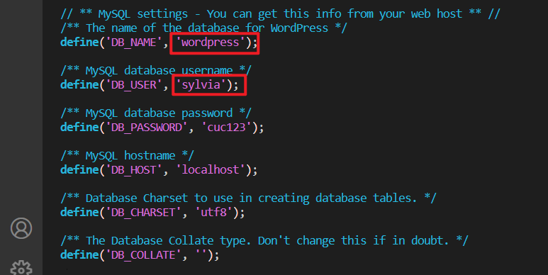

# 第四章作业报告

## 实验目的

- Web服务器（实验）：

  支持反向代理、流量控制、关键词过滤等功能的高级Web服务器配置

## 实验环境

- 客户端

  Windows 10

- 服务器端

  Ubuntu 20.04

  - VeryNginx （80）
  - Nginx （8080）
  - Wordpress 4.7 （8081）
  - DVWA （8082）

## 实验要求

### 基本要求

- 在一台主机（虚拟机）上同时配置[Nginx](http://nginx.org/)和[VeryNginx](https://github.com/alexazhou/VeryNginx)
  - VeryNginx作为本次实验的Web App的反向代理服务器和WAF
  - PHP-FPM进程的反向代理配置在nginx服务器上，VeryNginx服务器不直接配置Web站点服务
- 使用[Wordpress](https://wordpress.org/)搭建的站点对外提供访问的地址为： http://wp.sec.cuc.edu.cn
- 使用[Damn Vulnerable Web Application (DVWA)](http://www.dvwa.co.uk/)搭建的站点对外提供访问的地址为： http://dvwa.sec.cuc.edu.cn

### 安全加固要求

- 使用IP地址方式均无法访问上述任意站点，并向访客展示自定义的**友好错误提示信息页面-1**
- [Damn Vulnerable Web Application (DVWA)](http://www.dvwa.co.uk/)只允许白名单上的访客来源IP，其他来源的IP访问均向访客展示自定义的**友好错误提示信息页面-2**
- 在不升级Wordpress版本的情况下，通过定制[VeryNginx](https://github.com/alexazhou/VeryNginx)的访问控制策略规则，**热**修复[WordPress < 4.7.1 - Username Enumeration](https://www.exploit-db.com/exploits/41497/)
- 通过配置[VeryNginx](https://github.com/alexazhou/VeryNginx)的Filter规则实现对[Damn Vulnerable Web Application (DVWA)](http://www.dvwa.co.uk/)的SQL注入实验在低安全等级条件下进行防护

### VeryNginx配置要求

- [VeryNginx](https://github.com/alexazhou/VeryNginx)的Web管理页面仅允许白名单上的访客来源IP，其他来源的IP访问均向访客展示自定义的**友好错误提示信息页面-3**

- 通过定制

  VeryNginx

  的访问控制策略规则实现：

  - 限制DVWA站点的单IP访问速率为每秒请求数 < 50
  - 限制Wordpress站点的单IP访问速率为每秒请求数 < 20
  - 超过访问频率限制的请求直接返回自定义**错误提示信息页面-4**
  - 禁止curl访问

## 实验步骤

### 基本要求

- 在宿主机和虚拟机中修改hosts配置

  ```
  192.168.56.101 vn.sec.cuc.edu.cn
  192.168.56.101 dvwa.sec.cuc.edu.cn
  192.168.56.101 wp.sec.cuc.edu.cn
  ```

  

  

#### Niginx

- 安装Nginx

  ```
  sudo apt update
  sudo apt install nginx
  ```

- PHP-FPM进程的反向代理配置

  ```
  #安装
  sudo apt install php-fpm php-mysql php-curl php-gd php-intl php-mbstring php-soap php-xml php-xmlrpc php-zip
  ```

- 修改配置文件

  ```
  sudo vim /etc/nginx/sites-enabled/default
  
          root /var/www/html/wp.sec.cuc.edu.cn;
  
          # Add index.php to the list if you are using PHP
          index readme.html index.php ;
  
          server_name _;
  
          location / {
                  # First attempt to serve request as file, then
                  # as directory, then fall back to displaying a 404.
                  try_files $uri $uri/ =404;
          }
  
          # pass PHP scripts to FastCGI server
          #
          location ~ \.php$ {
          #       include snippets/fastcgi-php.conf;
          #
          #       # With php-fpm (or other unix sockets):
                  fastcgi_pass unix:/var/run/php/php7.4-fpm.sock;
                  fastcgi_index index.php;
                  fastcgi_param SCRIPT_FILENAME $document_root$fastcgi_script_name;
                  include fastcgi_params;
                  # With php-cgi (or other tcp  sockets):
          #       fastcgi_pass 127.0.0.1:9000;
          #}
  ```

  

#### VeryNginx

- 下载依赖

  ```
  # zlib
  sudo apt install zlib1g-dev
  # pcre
  sudo apt install libpcre3 libpcre3-dev
  # gcc 
  sudo apt install gcc
  # make
  sudo apt install make
  # penssl library
  sudo apt install libssl-dev
  ```

- 安装VeryNginx

  ```
  # 克隆VeryNginx仓库
  git clone https://github.com/alexazhou/VeryNginx.git
  # 进入仓库目录
  cd VeryNginx
  
  # 安装
  sudo python3 install.py install
  ```

- 修改配置文件

  ```
  sudo vim /opt/verynginx/openresty/nginx/conf/nginx.conf
  
  # 将user nginx改成user www-data
  # 修改监听端口为192.168.56.101:80
  
  # 进程权限
  chmod -R 777 /opt/verynginx/verynginx/configs
  
  # 启动
  sudo /opt/verynginx/openresty/nginx/sbin/nginx
  ```

- 测试成功

  

  在`http://192.168.56.101:8080/verynginx/index.html`页面登录

  

#### Wordpress

- 下载安装Wordpress

  ```
  # 下载安装包
  sudo wget https://wordpress.org/wordpress-4.7.zip
  
  # 解压
  7z x wordpress-4.7.zip
  
  # 将解压后的wordpress移到指定路径
  sudo mkdir /var/www/html/wp.sec.cuc.edu.cn
  sudo cp -r wordpress /var/www/html/wp.sec.cuc.edu.cn
  ```

- 安装Mysql，创建用户

  ```
  # 安装mysql
  sudo apt install mysql-server
  
  # 运行mysql
  sudo mysql
  
  # mysql操作
  # 建库
  CREATE DATABASE wordpress DEFAULT CHARACTER SET utf8 COLLATE utf8_unicode_ci;
  
  # 新建用户
  create user 'sylvia'@'localhost' identified by 'cuc123';
  
  # 授权
  grant all on wordpress.* to 'sylvia'@'localhost';
  
  # 刷新权限
  flush privileges;
  
  # 退出
  exit
  ```

- 修改Wordpress配置文件

  ```
  cd /var/www/html/wp.sec.cuc.edu.cn/wordpress
  sudo vim wp-config-sample.php
  
  #修改文件内容完成后，修改文件名
  sudo mv wp-config-sample.php wp-config.php
  ```

  

- 在Nginx基础上搭建站点

  ```
  #复制nginx的配置文件
  sudo cp /etc/nginx/sites-available/default /etc/nginx/sites-available/wp
  
  #修改配置文件
  sudo vim /etc/nginx/sites-available/wp
  
  # 修改监听端口
  listen 8081 default_server;
  listen [::]:8081 default_server;
  
  # 修改网站根站点，为wordpress的安装目录
  root /var/www/html/wp.sec.cuc.edu.cn/wordpress;
  
  # 修改server_name
  server_name wp.sec.cuc.edu.cn;
  
  # 添加index.php
  index index.php index.html index.htm index.nginx-debian.html;
  ```

  

- 建立连接

  ```
  # 语法检查    
  sudo nginx -t
  
  # 建立软链接
  sudo ln -s /etc/nginx/sites-available/wp /etc/nginx/sites-enabled/
  
  # 启动nginx
  sudo systemctl restart nginx
  ```

  安装后登陆成功

  

#### DVWA

- 安装

  ```
  # 下载
  git clone https://github.com/digininja/DVWA.git
  
  # 建立目录
  sudo mkdir /var/www/html/dvwa.sec.cuc.edu.cn
  
  # 移动文件夹内容至该目录下
  sudo mv DVWA/* /var/www/html/dvwa.sec.cuc.edu.cn
  
  # 修改文件夹属主为 www-data
  sudo chown -R www-data:www-data /var/www/html/dvwa.sec.cuc.edu.cn
  ```

- 配置MySQL

  ```
  # 启动MySQL
  sudo mysql
  
  # 建立dvwa的数据库
  create database dvwa;
  
  # 创建用户
  create user dvwa@localhost identified by 'p@ssw0rd';
  
  # 授权
  grant all on dvwa.* to dvwa@localhost;
  
  # 刷新权限
  flush privileges;
  
  # 退出
  exit
  
  # 重启mysql使配置文件生效
  sudo systemctl restart mysql
  ```

- 配置PHP

  ```
  cd `/var/www/html/dvwa.sec.cuc.edu.cn/config/`
  
  # 文件重命名
  sudo mv config.inc.php.dist config.inc.php
  
  # 修改php-fpm文件
  sudo vim /etc/php/7.4/fpm/php.ini
  
  display_errors: Off
  safe_mode: Off
  allow_url_include: On
  allow_url_fopen: On
  
  # 重启php
  sudo systemctl restart php7.4-fpm.service
  ```

- 创建配置文件

  ```
  # 创建nginx配置文件
  sudo cp /etc/nginx/sites-available/wp /etc/nginx/sites-available/dvwa
  sudo vim /etc/nginx/sites-available/dvwa
  
  # 修改内容
  listen 8082 default_server;
  listen [::]:8082 default_server;
  
  root /var/www/html/dvwa.sec.cuc.edu.cn;
  
  server_name dvwa.sec.cuc.edu.cn;
  
  index index.php index.html index.htm index.nginx-debian.html;
  ```

- 建立连接

  ```
  # 语法检查
  sudo nginx -t
  
  # 创建软链接
  sudo ln -s /etc/nginx/sites-available/dvwa /etc/nginx/sites-enabled/
  
  # 重启nginx
  sudo systemctl restart nginx
  ```

- 连接网页`192.168.56.101:8082/login.php`，登陆成功

  

- 

### 安全加固要求


### VeryNginx配置要求

## 实验总结

- 记得勾选文件查看中的显示隐藏项目，刚开始做作业就麻了，根本找不到hosts文件在哪里，后来发现是被隐藏了


## 参考链接

- 
