# 第三章作业报告

## 实验目的

- 开机自启动项管理


## 实验环境

- VirtualBox 6.1

  Ubuntu 20.04.02 Server 64bit

## 实验要求

### 动手实战Systemd

- [Systemd 入门教程：命令篇 by 阮一峰的网络日志](http://www.ruanyifeng.com/blog/2016/03/systemd-tutorial-commands.html)

  [Systemd 入门教程：实战篇 by 阮一峰的网络日志](http://www.ruanyifeng.com/blog/2016/03/systemd-tutorial-part-two.html)

  - 参照第2章作业的要求，完整实验操作过程通过[asciinema](https://asciinema.org/)进行录像并上传，文档通过`github`上传

### 本章完成后的自查清单

- 如何添加一个用户并使其具备`sudo`执行程序的权限？
- 如何将一个用户添加到一个用户组？
- 如何查看当前系统的分区表和文件系统详细信息？
- 如何实现开机自动挂载`Virtualbox`的共享目录分区？
- 基于LVM（逻辑分卷管理）的分区如何实现动态扩容和缩减容量？
- 如何通过`systemd`设置实现在网络连通时运行一个指定脚本，在网络断开时运行另一个脚本？
- 如何通过`systemd`设置实现一个脚本在任何情况下被杀死之后会立即重新启动？实现杀不死？

## 实验步骤

### 动手实战Systemd

#### Systemd 入门教程：命令篇

##### 一、系统管理

- `systemctl`是 Systemd 的主命令，用于管理系统

  ```
  # 重启系统
  $ sudo systemctl reboot
  
  # 关闭系统，切断电源
  $ sudo systemctl poweroff
  
  # CPU停止工作
  $ sudo systemctl halt
  
  # 暂停系统
  $ sudo systemctl suspend
  
  # 让系统进入冬眠状态
  $ sudo systemctl hibernate
  
  # 让系统进入交互式休眠状态
  $ sudo systemctl hybrid-sleep
  
  # 启动进入救援状态（单用户状态）
  $ sudo systemctl rescue
  ```

  `sudo systemctl reboot`重启系统

  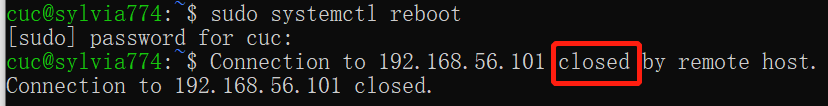

  `sudo systemctl poweroff`关闭系统，切断电源

  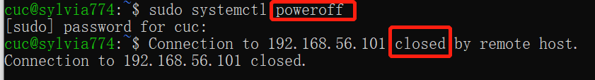

  打开VirtualBox，Ubuntu20.04已被关闭

  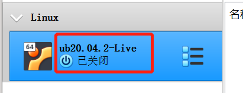

  `sudo systemctl halt`让系统进入冬眠状态

  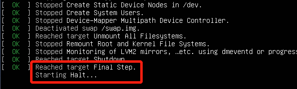

  （剩下的两个命令让系统进入休眠状态实在是不知道要怎么展示实验成果了😥）

  `sudo systemctl rescue` 启动进入救援状态（单用户状态）

  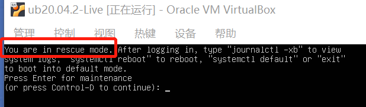

- `systemd-analyze`命令用于查看启动耗时

  ```
  # 查看启动耗时
  $ systemd-analyze                                                                                       
  # 查看每个服务的启动耗时
  $ systemd-analyze blame
  
  # 显示瀑布状的启动过程流hain
  
  # 显示指定服务的启动流
  $ systemd-analyze critical-chain atd.service
  ```
  
  [](https://asciinema.org/a/OTvbiXnesitSV2F5JTevhvnD1)
  
- `hostnamectl`命令用于查看当前主机的信息

  ```
  # 显示当前主机的信息
  $ hostnamectl

  # 设置主机名。
  $ sudo hostnamectl set-hostname sylvia774
  ```
  
  [](https://asciinema.org/a/KGO4WhLQIQQnUcSsPEgtCuDHK)

- `localectl`命令用于查看本地化设置

  ```
  # 查看本地化设置
  $ localectl

  # 设置本地化参数。
  $ sudo localectl set-locale LANG=en_GB.utf8
  $ sudo localectl set-keymap en_GB
  ```
  
  [](https://asciinema.org/a/dM4FnW6iTEiZ6UU5uhWTVjW9v)

- `timedatectl`命令用于查看当前时区设置

  ```
  # 查看当前时区设置
  $ timedatectl
  
  # 显示所有可用的时区
  $ timedatectl list-timezones                                                              
  # 需要先将时间自动同步关闭
  $ sudo timedatectl set-ntp no
  
  # 设置当前时区
  $ sudo timedatectl set-timezone America/New_York
  $ sudo timedatectl set-time YYYY-MM-DD
  $ sudo timedatectl set-time HH:MM:SS
  ```
  
  [](https://asciinema.org/a/snFkPPCKwZrSnhbSOmFZq6Ke4)
  
-  `loginctl`命令用于查看当前登录的用户。

  ```
  # 列出当前session
  $ loginctl list-sessions
  
  # 列出当前登录用户
  $ loginctl list-users
  
  # 列出显示指定用户的信息
  $ loginctl show-user 1000
  ```

  [](https://asciinema.org/a/OHOWmPIgCaPqAujO7mcirzwNQ)

##### 二、Unit

- `systemctl list-units`命令可以查看当前系统的所有 Unit 

  ```
  # 列出正在运行的 Unit
  $ systemctl list-units

  # 列出所有Unit，包括没有找到配置文件的或者启动失败的
  $ systemctl list-units --all

  # 列出所有没有运行的 Unit
  $ systemctl list-units --all --state=inactive

  # 列出所有加载失败的 Unit
  $ systemctl list-units --failed

  # 列出所有正在运行的、类型为 service 的 Unit
  $ systemctl list-units --type=service
  ```

  [](https://asciinema.org/a/1O22RUkjJG7IFxdXFsRQuETGo)

- `systemctl status`命令用于查看系统状态和单个 Unit 的状态

  ```
  # 显示系统状态
  $ systemctl status

  # 显示单个 Unit 的状态
  $ systemctl status ssh.service

  # 显示远程主机的某个 Unit 的状态
  $ systemctl -H root@XXX.XXX.XXX.XXX status XXX.service
  ```

  [](https://asciinema.org/a/PJnq06G1SXX1TjO17uIGtp3aU)

  除了`status`命令，`systemctl`还提供了三个查询状态的简单方法，主要供脚本内部的判断语句使用。

  ```
  # 显示某个 Unit 是否正在运行
  $ systemctl is-active XXX.service

  # 显示某个 Unit 是否处于启动失败状态
  $ systemctl is-failed XXX.service

  # 显示某个 Unit 服务是否建立了启动链接
  $ systemctl is-enabled XXX.service
  ```

  [](https://asciinema.org/a/WydyvuUWPV3e3dBx6iyuNTD5O)

- Unit 管理（启动和停止 Unit（主要是 `service`））

  （Ubuntu中使用`apache2`）

  ```
  # 立即启动一个服务
  $ sudo systemctl start apache.service

  # 立即停止一个服务
  $ sudo systemctl stop apache.service

  # 重启一个服务
  $ sudo systemctl restart apache.service

  # 杀死一个服务的所有子进程
  $ sudo systemctl kill apache.service

  # 重新加载一个服务的配置文件
  $ sudo systemctl reload apache.service

  # 重载所有修改过的配置文件
  $ sudo systemctl daemon-reload

  # 显示某个 Unit 的所有底层参数
  $ systemctl show httpd.service

  # 显示某个 Unit 的指定属性的值
  $ systemctl show -p CPUShares httpd.service

  # 设置某个 Unit 的指定属性
  $ sudo systemctl set-property httpd.service CPUShares=500
  ```

  [](https://asciinema.org/a/NHmLVPsWYIyjMZaOgasqKDvHq)

- Unit 之间存在依赖关系：A 依赖于 B，就意味着 `Systemd` 在启动 A 的时候，同时会去启动 B。

  `systemctl list-dependencies`命令列出一个 Unit 的所有依赖。

  ```
  # systemctl list-dependencies命令列出一个 Unit 的所有依赖。
  $ systemctl list-dependencies nginx.service
  
  # 上面命令的输出结果之中，有些依赖是 Target 类型（详见下文），默认不会展开显示。如果要展开 Target，就需要使用--all参数。
  $ systemctl list-dependencies --all nginx.service
  ```

  [](https://asciinema.org/a/l2xeJWl5PsuDaMGTWT8dewnEl)

##### 三、Unit的配置文件

- 每一个 Unit 都有一个配置文件，告诉 `Systemd` 怎么启动这个 Unit

  `systemctl enable`命令用于在上面两个目录之间，建立符号链接关系

  ```
  $ sudo systemctl enable clamd@scan.service
  # 等同于
  $ sudo ln -s '/usr/lib/systemd/system/clamd@scan.service' '/etc/systemd/system/multi-user.target.wants/clamd@scan.service'

  # systemctl disable命令用于在两个目录之间，撤销符号链接关系，相当于撤销开机启动
  $ sudo systemctl disable clamd@scan.service
  ```

  [](https://asciinema.org/a/6n2Z0EVjPRWfDLxJjn59yr9uD)

- 配置文件的状态

  `systemctl list-unit-files`命令用于列出所有配置文件。

  ```
  # 列出所有配置文件
  $ systemctl list-unit-files

  # 列出指定类型的配置文件
  $ systemctl list-unit-files --type=service

  # 注意，从配置文件的状态无法看出，该 Unit 是否正在运行。这必须执行前面提到的systemctl status命令
  $ systemctl status bluetooth.service

  # 一旦修改配置文件，就要让 SystemD 重新加载配置文件，然后重新启动，否则修改不会生效
  $ sudo systemctl daemon-reload
  $ sudo systemctl restart httpd.service
  ```

  [](https://asciinema.org/a/wfp5659oG6tmKYYOcabzxWQxW)

-  配置文件的格式

  配置文件就是普通的文本文件，可以用文本编辑器打开。

  `systemctl cat`命令可以查看配置文件的内容

  ```
  $ systemctl cat atd.service
  
  [Unit]
  Description=ATD daemon
  
  [Service]
  Type=forking
  ExecStart=/usr/bin/atd
  
  [Install]
  WantedBy=multi-user.target
  ```

  [](https://asciinema.org/a/ISnxU2Ba55v5CLvPsrq2zg0c1)

##### 四、Target

- Target 就是一个 Unit 组，包含许多相关的 Unit。

  Target 这个概念类似于"状态点"，启动某个 Target 就好比启动到某种状态

  ```
  # 查看当前系统的所有 Target
  $ systemctl list-unit-files --type=target
  
  # 查看一个 Target 包含的所有 Unit
  $ systemctl list-dependencies multi-user.target
  
  # 查看启动时的默认 Target
  $ systemctl get-default
  
  # 设置启动时的默认 Target
  $ sudo systemctl set-default multi-user.target
  
  # 切换 Target 时，默认不关闭前一个 Target 启动的进程，
  # systemctl isolate 命令改变这种行为，
  # 关闭前一个 Target 里面所有不属于后一个 Target 的进程
  $ sudo systemctl isolate multi-user.target
  ```

  [](https://asciinema.org/a/jcULM6ZLGxiyMce2BWu8iwwSj)

##### 五、日志管理

- `journalctl`功能强大，用法非常多

  ```
  # 查看所有日志（默认情况下 ，只保存本次启动的日志）
  $ sudo journalctl
  
  # 查看内核日志（不显示应用日志）
  $ sudo journalctl -k
  
  # 查看系统本次启动的日志
  $ sudo journalctl -b
  $ sudo journalctl -b -0
  
  # 查看上一次启动的日志（需更改设置）
  $ sudo journalctl -b -1
  
  # 查看指定时间的日志
  $ sudo journalctl --since="2012-10-30 18:17:16"
  $ sudo journalctl --since "20 min ago"
  $ sudo journalctl --since yesterday
  $ sudo journalctl --since "2015-01-10" --until "2015-01-11 03:00"
  $ sudo journalctl --since 09:00 --until "1 hour ago"
  
  # 显示尾部的最新10行日志
  $ sudo journalctl -n
  
  # 显示尾部指定行数的日志
  $ sudo journalctl -n 20
  
  # 实时滚动显示最新日志
  $ sudo journalctl -f
  
  # 查看指定服务的日志
  $ sudo journalctl /usr/lib/systemd/systemd
  
  # 查看指定进程的日志
  $ sudo journalctl _PID=1
  
  # 查看某个路径的脚本的日志
  $ sudo journalctl /usr/bin/bash
  
  # 查看指定用户的日志
  $ sudo journalctl _UID=33 --since today
  
  # 查看某个 Unit 的日志
  $ sudo journalctl -u nginx.service
  $ sudo journalctl -u nginx.service --since today
  
  # 实时滚动显示某个 Unit 的最新日志
  $ sudo journalctl -u nginx.service -f
  
  # 合并显示多个 Unit 的日志
  $ journalctl -u nginx.service -u php-fpm.service --since today
  
  # 查看指定优先级（及其以上级别）的日志，共有8级
  # 0: emerg
  # 1: alert
  # 2: crit
  # 3: err
  # 4: warning
  # 5: notice
  # 6: info
  # 7: debug
  $ sudo journalctl -p err -b
  
  # 日志默认分页输出，--no-pager 改为正常的标准输出
  $ sudo journalctl --no-pager
  
  # 以 JSON 格式（单行）输出
  $ sudo journalctl -b -u nginx.service -o json
  
  # 以 JSON 格式（多行）输出，可读性更好
  $ sudo journalctl -b -u nginx.serviceqq
   -o json-pretty
  
  # 显示日志占据的硬盘空间
  $ sudo journalctl --disk-usage
  
  # 指定日志文件占据的最大空间
  $ sudo journalctl --vacuum-size=1G
  
  # 指定日志文件保存多久
  $ sudo journalctl --vacuum-time=1years
  ```

  [](https://asciinema.org/a/Y14dT9Gn5IoaPPjgi0Z32jb0J)

#### Systemd 入门教程：实战篇

-  如何使用`Systemd`的主要命令完成一些基本的任务

  ```
  # 让该软件开机启动
  $ sudo systemctl enable apache2
  
  # 设置开机启动以后，软件并不会立即启动，必须等到下一次开机。如果想现在就运行该软件，那么要执行systemctl start命令
  $ sudo systemctl start apache2
  
  # 执行上面的命令以后，有可能启动失败，因此要用systemctl status命令查看一下该服务的状态
  $ sudo systemctl status apache2
  
  # 终止正在运行的服务，需要执行systemctl stop命令
  $ sudo systemctl stop apache2.service
  
  # 有时候，该命令可能没有响应，服务停不下来。这时候就不得不"杀进程"了，向正在运行的进程发出kill信号
  $ sudo systemctl kill apache2.service
  
  # 此外，重启服务要执行systemctl restart命令
  $ sudo systemctl restart apache2.service
  
  # Systemd 有默认的启动 Target
  $ systemctl get-default
  
  # 查看 multi-user.target 包含的所有服务
  $ systemctl list-dependencies multi-user.target
  
  # 切换到另一个 target
  # shutdown.target 就是关机状态
  $ sudo systemctl isolate shutdown.target
  
  # Target 也有自己的配置文件
  $ systemctl cat multi-user.target
  
  # 重新加载配置文件
  $ sudo systemctl daemon-reload
  
  # 重启相关服务
  $ sudo systemctl restart apache2
  ```

  [](https://asciinema.org/a/H4XvIXGvoNIjsJ0qoMhI4wYE6)

### 本章完成后的自查清单

- ##### 如何添加一个用户并使其具备`sudo`执行程序的权限？

  ```
  #新建用户
  sudo adduser test
  
  #添加sudo权限
  sudo usermod -G sudo test
  
  #查看系统上拥有sudo权限的所有用户
  getent group sudo 
  ```

  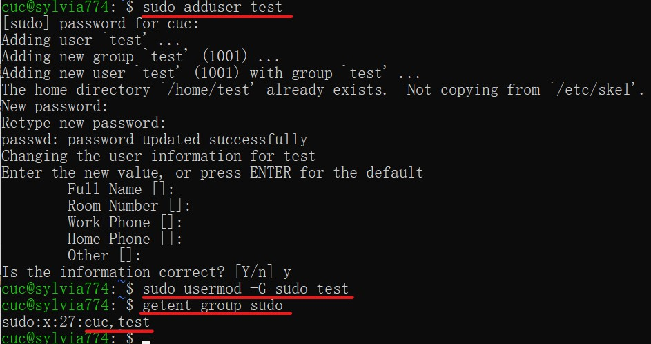

- ##### 如何将一个用户添加到一个用户组？

  ```
  #新建用户组testgroup
  sudo addgroup testgroup
  
  #查看test用户当前组
  groups test
  
  #将test用户添加到testgroup
  （-a代表append，也就是将用户添加到新用户组中而不必离开原有的其他用户组）
  sudo usermod -a -G testgroup test
  
  #再次查看test用户已加入的组别，添加成功
  groups test
  ```

  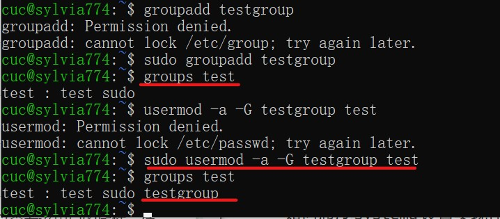

- ##### 如何查看当前系统的分区表和文件系统详细信息？

  ```
  # 查看分区表
  sudo fdisk -sudo fdisk -l
  
  # 查看文件系统信息
  df -T -h
  ```

  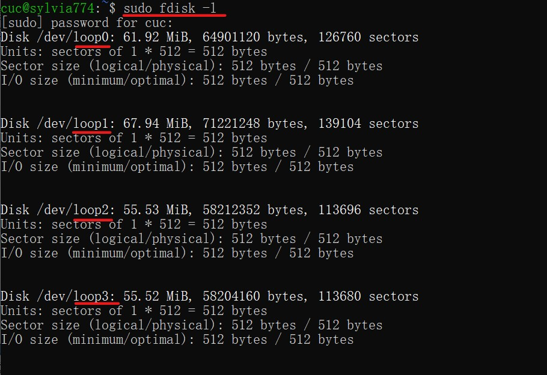

  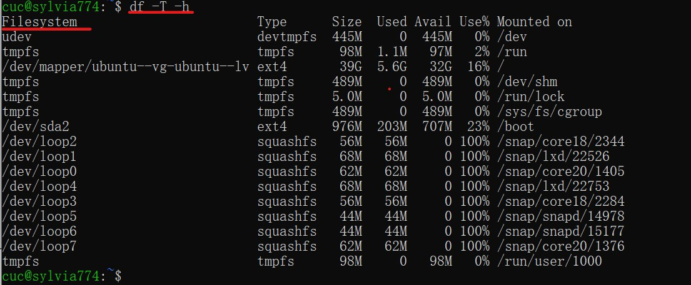

- ##### 如何实现开机自动挂载`Virtualbox`的共享目录分区？

  - 新建共享文件夹`sharefile`

    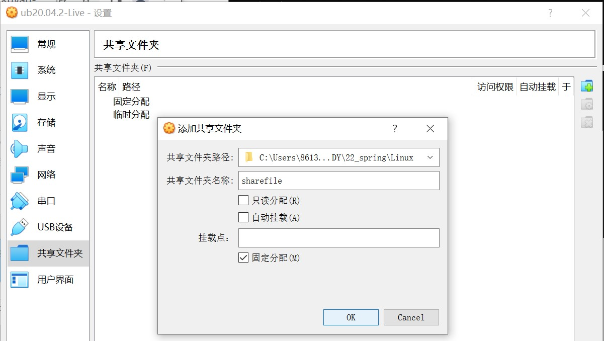

  - 在`/mnt`路径下新建共享文件的挂载目录`share`

    ```
    sudo mkdir /mnt/share
    ```

  - 执行挂载命令（别在share目录里执行！）

    ```
    sudo mount -t vboxsf sharefile /mnt/share
    ```

    

  - 修改`fstab`文件

    ```
    # 打开'/etc/fstab'文件
    vim /etc/fstab
    
    # 在文件最后添加以下语句（记住保存后退出）
    sharefile /mnt/share/ vboxsf default 0  0
    
    # 重启后，查看是否成功
    df -h
    ```

    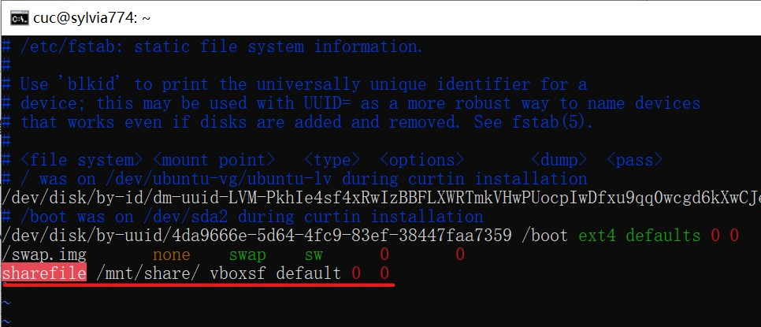

    重启查看文件系统，挂载成功

    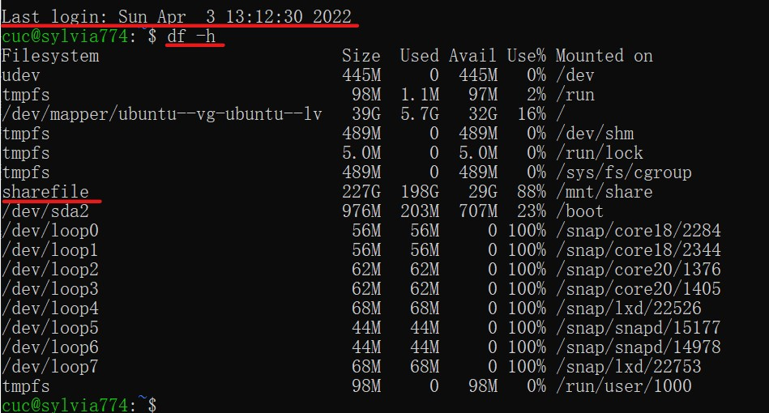

- ##### 基于LVM（逻辑分卷管理）的分区如何实现动态扩容和缩减容量？

  - 提前创建新物理硬盘后重启

    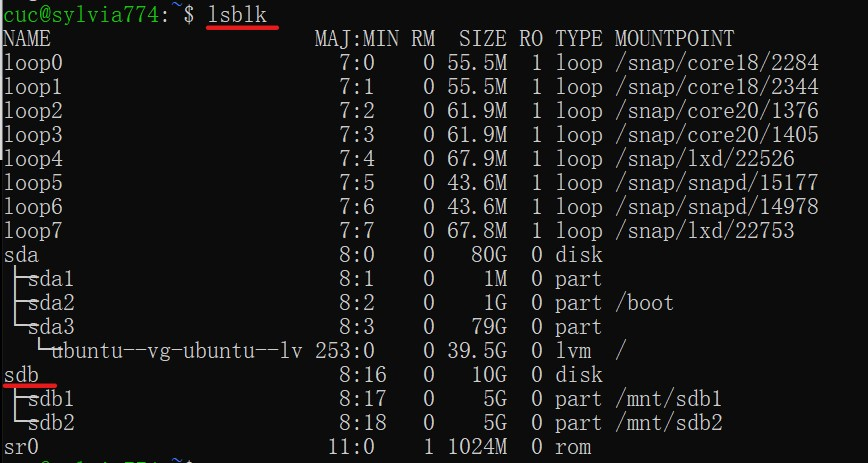

  - 建立VG，LV

    ```
    # 创建demo-vg
    vgcreate demo-vg /dev/sdb{1,2}
    
    # 创建lv-1，lv-2
    lvcreate -L 4G -n lv-1 demo-vg
    lvcreate -l 100%FREE -n lv-2 demo-vg
    ```

    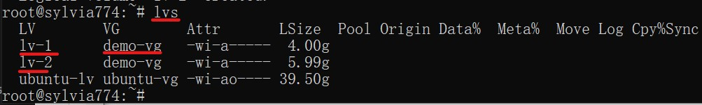

  - 实现动态扩容和缩减容量

    ```
    # 扩容
    lvextend -L +2G /dev/demo-vg/lv-1
    
    # 减容
    lvreduce -L -2G /dev/demo-vg/lv-1
    ```

    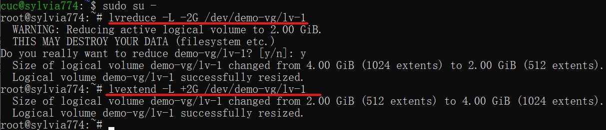

- ##### 如何通过`systemd`设置实现 在网络连通时运行一个指定脚本，在网络断开时运行另一个脚本？

  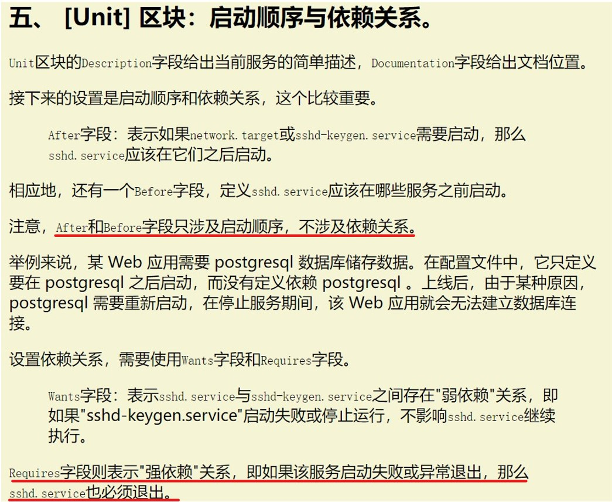

  于是编写新配置文件，设置[Unit]`Requires=`，`After=`字段，使新配置文件依赖网络运行不同脚本

  - 编写新配置文件`test.service`

    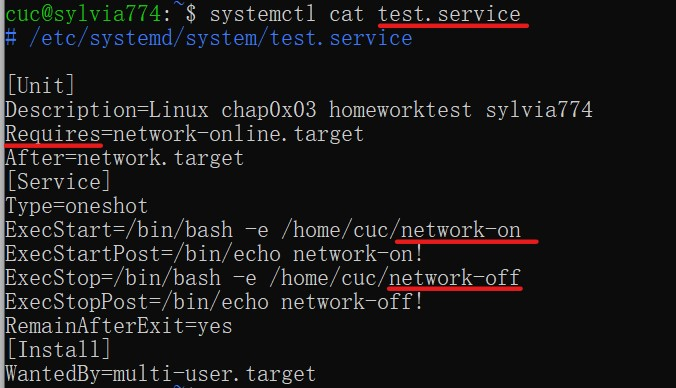

  - 编写配置文件内的两个不同脚本

    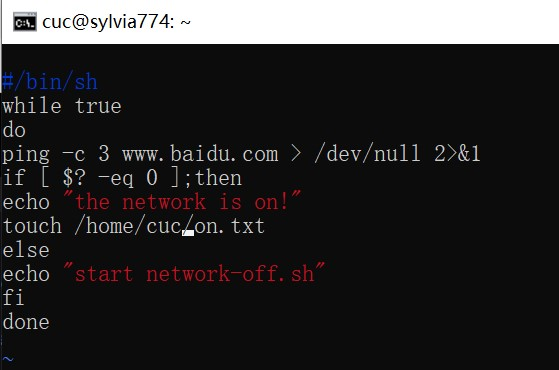

    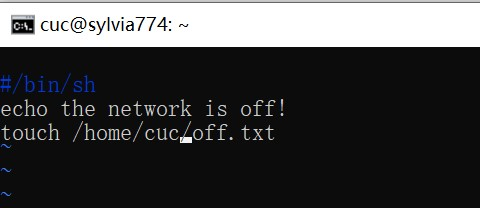

  - 重载后运行`test.service`

    （注：录屏可以发现，期间只手动开启`test.service`以及停止网络`network-online.target`运行，并未手动停止`test.service`的运行，但其却随着网络的中断而自动停止运行了，证明其依赖关系成立

    即实现了在网络连通时运行一个指定脚本（on.txt），在网络断开时运行另一个脚本（off.txt））

    [](https://asciinema.org/a/O46laWjmYSEczqX9wdjVyaeRW)

  - 查看日志

    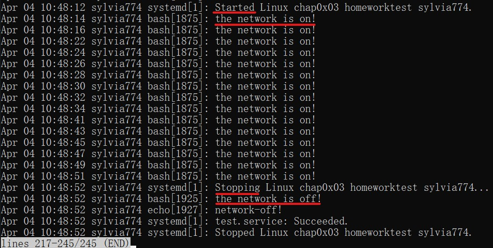

- ##### 如何通过`systemd`设置实现一个脚本在任何情况下被杀死之后会立即重新启动？实现杀不死？

  根据 [Systemd 入门教程：实战篇](http://www.ruanyifeng.com/blog/2016/03/systemd-tutorial-part-two.html) 里所提到的`Restart`字段设置可知

  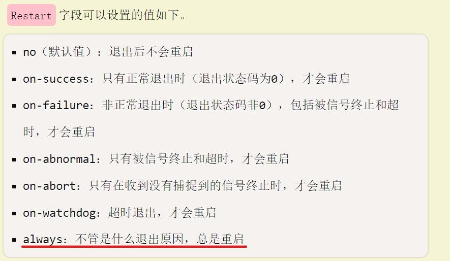

  于是设置

  ```
  [Service]
  Restart = always
  ```

  

  实验如下，成功实现停止后重启

  [](https://asciinema.org/a/ESXjiVPFDexiqECZAp5HbNkJV)

## 实验总结

- `timedatectl`设置当前时区时发现报错

  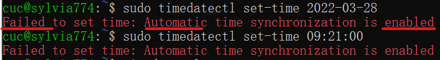

  搜索后再定睛一看，发现时间已经自动同步

  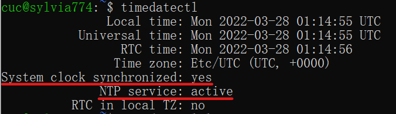

  搜索参考资料后需要关闭自动同步

  `timedatectl set-ntp no`
  
  然后成功  
  
  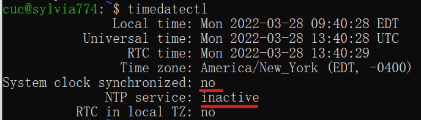

- 操作命令`systemctl status bluetooth.service`时发现报错

  （BTW网页上原命令作者也写错了，要细心一点）

  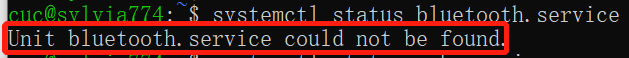

  查找后发现确实没有`bluetooth.service`，所以在查找出的`service`里面选一个就好了

  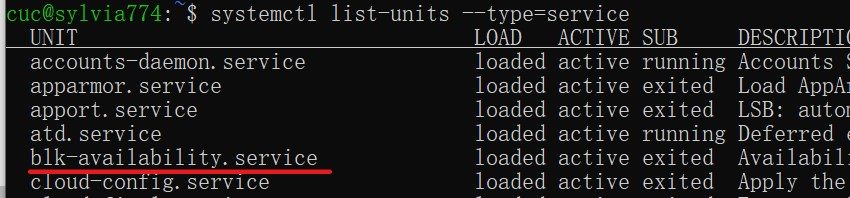

- 命令`systemctl -H root@rhel7.example.com status httpd.service`都没能运行成功，`example.com`每次输入都报错，不知道正确格式是什么，所以换了种方式连接到云起实验室的远程`CentOS`上查看`aliyun.service`，没按照他的意思查看`httpd.service`

- 这个`httpd.service`真的折磨了我很久，首先使用`systemctl show`可以显示此Unit的底层参数，指定属性也操作成功，但是设定他的属性就会失败，无法找到此配置文件

  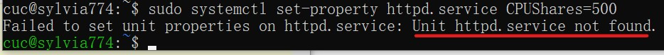

  一直都没有办法找到它的路径在哪里，也无法`apt install httpd`，只能够`apt install apache2`以为`httpd`包含在了`apache2`里

  询问师姐，更换了很多个路径无法定位，最后才发现`httpd`居然就是`apache2`。。。哈哈，真的是很无语。。。
  
  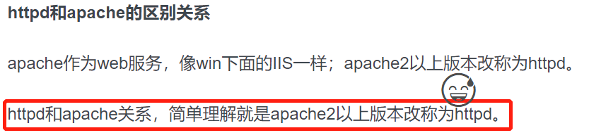

- 关于网络联通运行指定脚本题目真的做了好久😭，一开始觉得作业的意思是自己编写配置文件，在[service]内部修改`ExecStart=`数据达到效果，但是不确定询问师姐，转而修改Ubuntu的系统网络配置文件`systemd-networkd.service`，期间一波三折，，找不到配置文件的具体位置也不知道要怎么用`vim`修改，

  好不容易修改完成了重启，果然报错了。。。完蛋了彻底没网了，`ssh`也连不上了

  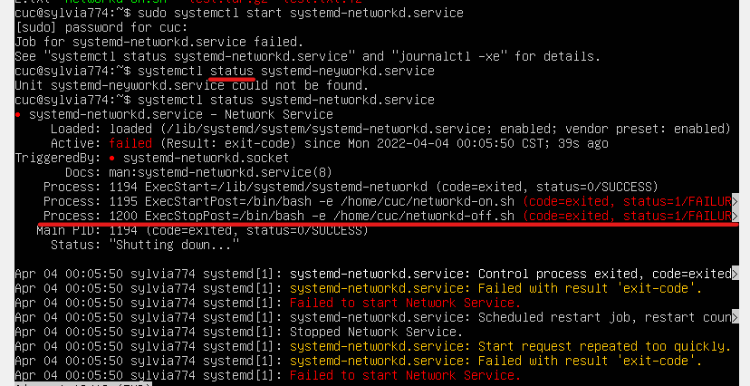

  （幸好提前乖乖备份了）

  不知道下一步怎么做了，询问了HW老师，才发现之前自己做的和题目意思八竿子打不着。

  原来是在[Unit]依赖关系上做文章，编写配置文件`Requires=`依赖网络的相关字段，实现不同情况下的不同操作。这道题目参考了WR同学的作业思路，并进行了改进。

- 修改报告标题语法

  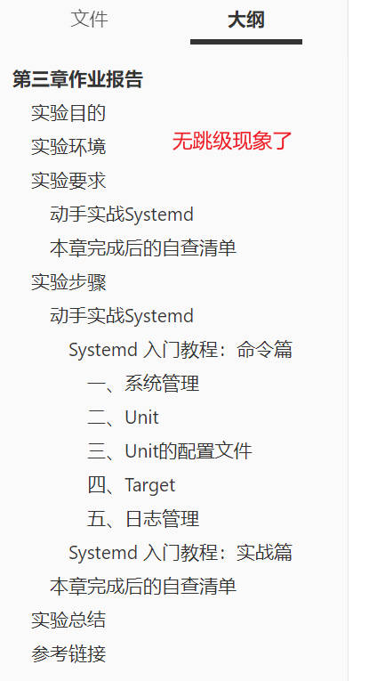

  编辑删除`network-on`脚本文件`echo "the network is on!"`，防止出现污染脚本情况

  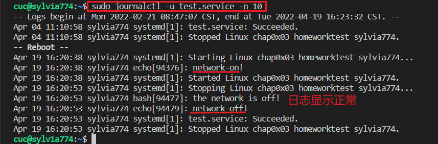

## 参考链接

- [centos7修改服务器时间报错--Failed to set time: Automatic time synchronization is enabled](https://blog.csdn.net/xzm5708796/article/details/103733211)
- [httpd和apache区别](https://www.php.cn/apache/428670.html)
- [Ubuntu添加用户并赋sudo权限](https://blog.csdn.net/breeze5428/article/details/52837768)
- [在Virtualbox下为Ubuntu20.04开机自动挂载共享目录的方法](https://blog.csdn.net/jiangdan_lili/article/details/110003759)
- [如何编写一个Systemd Service](https://segmentfault.com/a/1190000014740871)
- [实验三：Linux服务器系统使用基础自查](https://github.com/CUCCS/2022-linux-public-worrycuc/tree/chapter-03/chapter%2003)