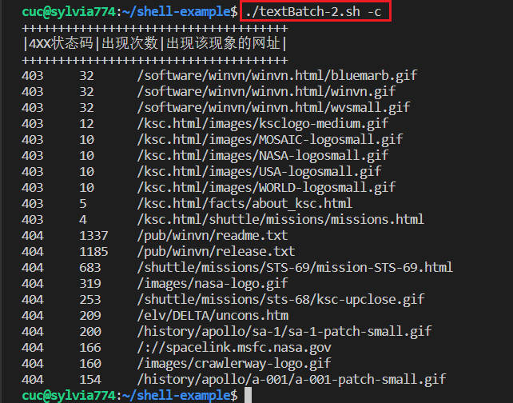
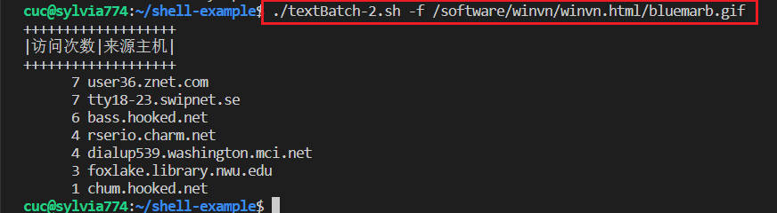

# 第四章作业报告

## 实验目的

- shell脚本编程练习基础：

  文本处理（考察去重、统计、排序等操作）、文件批量重命名（简单重命名规则、复杂重命名规则）


## 实验环境

- VirtualBox 6.1

  Ubuntu 20.04.02 Server 64bit

## 实验要求

- 任务一：用bash编写一个图片批处理脚本，实现以下功能：
  - - [x] 支持命令行参数方式使用不同功能
  - - [x] 支持对指定目录下所有支持格式的图片文件进行批处理
  - 支持以下常见图片批处理功能的单独使用或组合使用
    - - [x] 支持对`jpeg`格式图片进行图片质量压缩
    - - [x] 支持对`jpeg/png/svg`格式图片在保持原始宽高比的前提下压缩分辨率
    - - [x] 支持对图片批量添加自定义文本水印
    - - [x] 支持批量重命名（统一添加文件名前缀或后缀，不影响原始文件扩展名）
    - - [x] 支持将`png/svg`图片统一转换为`jpg`格式图片
- 任务二：用bash编写一个文本批处理脚本，对以下附件分别进行批量处理完成相应的数据统计任务：
  - 2014世界杯运动员数据
    - - [x] 统计不同年龄区间范围（20岁以下、[20-30]、30岁以上）的球员**数量**、**百分比**
    - - [x] 统计不同场上位置的球员**数量**、**百分比**
    - - [x] 名字最长的球员是谁？名字最短的球员是谁？
    - - [x] 年龄最大的球员是谁？年龄最小的球员是谁？
- 任务二：用bash编写一个文本批处理脚本，对以下附件分别进行批量处理完成相应的数据统计任务：
  - Web服务器访问日志
    - - [x] 统计访问来源主机TOP 100和分别对应出现的总次数
    - - [x] 统计访问来源主机TOP 100 IP和分别对应出现的总次数
    - - [x] 统计最频繁被访问的URL TOP 100
    - - [x] 统计不同响应状态码的出现次数和对应百分比
    - - [x] 分别统计不同4XX状态码对应的TOP 10 URL和对应出现的总次数
    - - [x] 给定URL输出TOP 100访问来源主机

## 实验报告要求

- 继承[第一章：Linux基础（实验）](https://c4pr1c3.github.io/LinuxSysAdmin/chap0x01.exp.md.html)的所有实验报告要求
- 上述任务的所有源代码文件必须单独提交并提供详细的**–help**脚本内置帮助信息
- 任务二的所有统计数据结果要求写入独立实验报告

## 实验步骤

作业仓库Travis CI链接： [CUCCS/2022-linux-public-sylvia774](https://app.travis-ci.com/github/CUCCS/2022-linux-public-sylvia774)

**任务一：用bash编写一个图片批处理脚本，实现以下功能：**

（详细代码见[imgProcessor.sh](./code/imgProcessor.sh)）

- 支持命令行参数方式使用不同功能

- 支持对指定目录下所有支持格式的图片文件进行批处理

- 支持以下常见图片批处理功能的单独使用或组合使用

  - 支持对`jpeg`格式图片进行图片质量压缩

    ```
    ./imgProcessor.sh -q ./img 90
    ```

    

  - 支持对`jpeg/png/svg`格式图片在保持原始宽高比的前提下压缩分辨率

    ```
    ./imgProcessor.sh -r ./img 90
    ```

    

  - 支持对图片批量添加自定义文本水印

    ```
    ./imgProcessor.sh -w ./img syl center 5
    ```

    
  
    查看`3.svg`，因为`svg`文件的特殊性很容易辨别出来水印添加成功
  
    
  
  - 支持批量重命名（统一添加文件名前缀或后缀，不影响原始文件扩展名）
  
    ```
    ./imgProcessor.sh -p ./img demo && ./imgProcessor.sh -s ./img !
    ```
  
    
  
  - 支持将`png/svg`图片统一转换为`jpg`格式图片
  
    ```
    ./imgProcessor.sh -t ./img
    ```
    
    

**任务二：用bash编写一个文本批处理脚本，对以下附件分别进行批量处理完成相应的数据统计任务：**

（详细代码见[textBatch-1.sh](./code/textBatch-1.sh)）

（详细数据统计见[task2-1.md](./task2-1.md)）

- 2014世界杯运动员数据

  - 统计不同年龄区间范围（20岁以下、[20-30]、30岁以上）的球员**数量**、**百分比**

    ```
    ./textBatch-1.sh -r
    ```

    

  - 统计不同场上位置的球员**数量**、**百分比**

    ```
    ./textBatch-1.sh -p
    ```

    
  
  - 名字最长的球员是谁？名字最短的球员是谁？
  
    ```
    ./textBatch-1.sh -n
    ```
  
    
  
  - 年龄最大的球员是谁？年龄最小的球员是谁？
  
    ```
    ./textBatch-1.sh -a
    ```
    
    

**任务二：用bash编写一个文本批处理脚本，对以下附件分别进行批量处理完成相应的数据统计任务：**

（详细代码见[textBatch-2.sh](./code/textBatch-2.sh)）

（详细数据统计见[task2-2.md](./task2-2.md)）

- Web服务器访问日志

  - 统计访问来源主机TOP 100和分别对应出现的总次数

    ```
    ./textBatch-2.sh -t
    ```

    

  - 统计访问来源主机TOP 100 IP和分别对应出现的总次数

    ```
    ./textBatch-2.sh -i
    ```

    

  - 统计最频繁被访问的URL TOP 100

    ```
    ./textBatch-2.sh -u
    ```

    
  
  - 统计不同响应状态码的出现次数和对应百分比
  
    ```
    ./textBatch-2.sh -s
    ```
  
    
  
  - 分别统计不同4XX状态码对应的TOP 10 URL和对应出现的总次数
  
    ```
    ./textBatch-2.sh -c
    ```
  
    
  
  - 给定URL输出TOP 100访问来源主机
  
    ```
    ./textBatch-2.sh -f /software/winvn/winvn.html/bluemarb.gif
    ```
    
    

## 实验总结

- 在畅课讨论区了解到`svg`图片无法使用`imagemagick -convert`压缩，但是参考了下往年的作业没有找到解决了此问题的范本，根据教程只有手动修改每一个`svg`图片的`width`，`height`值，此方法不能实现批处理，无法达成作业要求

  

  询问老师之后选择使用`sed`自动修改，但是每个图片的`width`，`height`值都不同，压缩值也不同，一条修改命令不能适用于所有`svg`图片，也无法实现批量处理

  再次询问老师，在教程中发现工具`rsvg-convert`, 可以批量压缩`svg`图片，查阅文档后运行成功，欣喜若狂，但是会输出新的压缩`svg`文件，不能在原文件上进行修改，也算完成了压缩`svg`图片的任务

  

  

- 对于任务二统计结果输出，将数据对齐敲了很久的空格，后来才发现可以用管道符'|'和'\t'，后续写入独立实验报告也方便快捷，果然这种精细繁琐的功夫需要格式化才行，下次不要再手动敲了，很浪费时间

- 关于Travis CI的部署，想先在自己的个人仓库中测试一下，push上去后发现Travis CI网页没有反应无法部署，并且顶端报错

  

  后来才发现需要组织和团体仓库才支持部署，个人仓库需要进行购买，在填写信用卡账号这一步就无法操作，不支持国内银行账户。。

## 参考链接

- [rsvg-convert](https://docs.oracle.com/cd/E88353_01/html/E37839/rsvg-convert-1.html)
- [CUCCS](https://github.com/CUCCS)/[2021-linux-public-kal1x](https://github.com/CUCCS/2021-linux-public-kal1x/tree/chap0x04)
- [Linux awk 命令](https://www.runoob.com/linux/linux-comm-awk.html)
- [How can I scale an SVG via command line?](https://superuser.com/questions/475851/how-can-i-scale-an-svg-via-command-line)
- [shell - 参数解析三种方式(手工, getopts, getopt)](https://bummingboy.top/2017/12/19/shell%20-%20%E5%8F%82%E6%95%B0%E8%A7%A3%E6%9E%90%E4%B8%89%E7%A7%8D%E6%96%B9%E5%BC%8F%28%E6%89%8B%E5%B7%A5,%20getopts,%20getopt%29/)
