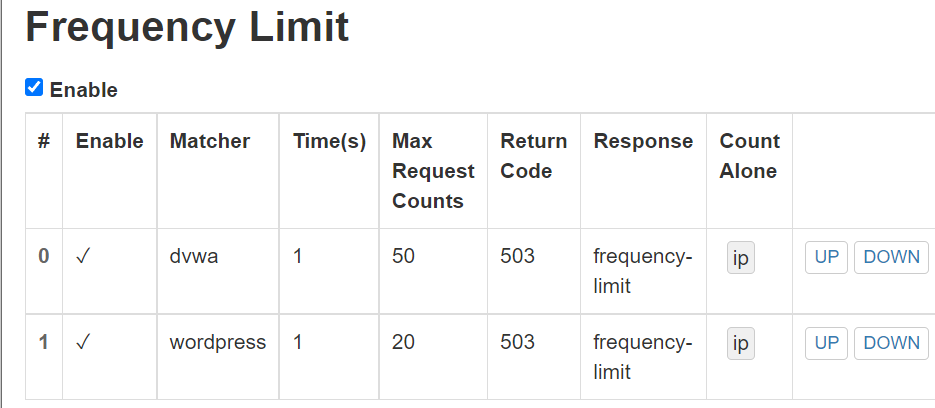

# 第五章作业报告

## 实验目的

- Web服务器（实验）：

  支持反向代理、流量控制、关键词过滤等功能的高级Web服务器配置

## 实验环境

- 客户端

  Windows 10

- 服务器端

  Ubuntu 20.04

  - VeryNginx （80）
  - Nginx （8080）
  - WordPress 4.7 （8081）
  - DVWA （8082）

## 实验要求

### 基本要求

- - [x] 在一台主机（虚拟机）上同时配置[Nginx](http://nginx.org/)和[VeryNginx](https://github.com/alexazhou/VeryNginx)
  
  - - [x] VeryNginx作为本次实验的Web App的反向代理服务器和WAF
  - - [x] PHP-FPM进程的反向代理配置在nginx服务器上，VeryNginx服务器不直接配置Web站点服务
  
- - [x] 使用[Wordpress](https://wordpress.org/)搭建的站点对外提供访问的地址为： http://wp.sec.cuc.edu.cn

- - [x] 使用[Damn Vulnerable Web Application (DVWA)](http://www.dvwa.co.uk/)搭建的站点对外提供访问的地址为： http://dvwa.sec.cuc.edu.cn

### 安全加固要求

- - [x] 使用IP地址方式均无法访问上述任意站点，并向访客展示自定义的**友好错误提示信息页面-1**
- - [x] [Damn Vulnerable Web Application (DVWA)](http://www.dvwa.co.uk/)只允许白名单上的访客来源IP，其他来源的IP访问均向访客展示自定义的**友好错误提示信息页面-2**
- - [x] 在不升级Wordpress版本的情况下，通过定制[VeryNginx](https://github.com/alexazhou/VeryNginx)的访问控制策略规则，**热**修复[WordPress < 4.7.1 - Username Enumeration](https://www.exploit-db.com/exploits/41497/)
- - [x] 通过配置[VeryNginx](https://github.com/alexazhou/VeryNginx)的Filter规则实现对[Damn Vulnerable Web Application (DVWA)](http://www.dvwa.co.uk/)的SQL注入实验在低安全等级条件下进行防护

### VeryNginx配置要求

- - [x] [VeryNginx](https://github.com/alexazhou/VeryNginx)的Web管理页面仅允许白名单上的访客来源IP，其他来源的IP访问均向访客展示自定义的**友好错误提示信息页面-3**

- - [x] 通过定制VeryNginx的访问控制策略规则实现：

  - 限制DVWA站点的单IP访问速率为每秒请求数 < 50
- - [x] 限制Wordpress站点的单IP访问速率为每秒请求数 < 20
  
  - 超过访问频率限制的请求直接返回自定义**错误提示信息页面-4**
- - [x] 禁止curl访问

## 实验步骤

### 基本要求

- 在宿主机`C:\Windows\System32\drivers\etc\hosts`中修改hosts配置，虚拟机中也要修改

  ```
  192.168.56.101 vn.sec.cuc.edu.cn
  192.168.56.101 dvwa.sec.cuc.edu.cn
  192.168.56.101 wp.sec.cuc.edu.cn
  ```

  

  

#### Niginx

- 安装Nginx

  ```
  sudo apt update
  sudo apt install nginx
  ```

- PHP-FPM组件安装

  ```
  sudo apt install php-fpm php-mysql php-curl php-gd php-intl php-mbstring php-soap php-xml php-xmlrpc php-zip
  ```
  
- 修改配置文件

  ```
  sudo vim /etc/nginx/sites-enabled/default
  
   root /var/www/html/wp.sec.cuc.edu.cn;
  
   # Add index.php to the list if you are using PHP
  index readme.html index.php ;
  
   location ~ \.php$ {
   #       include snippets/fastcgi-php.conf;
   #
   #       # With php-fpm (or other unix sockets):
           fastcgi_pass unix:/var/run/php/php7.4-fpm.sock;
           fastcgi_index index.php;
           fastcgi_param SCRIPT_FILENAME $document_root$fastcgi_script_name;
           include fastcgi_params;
           # With php-cgi (or other tcp  sockets):
   #       fastcgi_pass 127.0.0.1:9000;
   #}
  ```
  
  

#### VeryNginx

- 安装依赖

  ```
  # zlib
  sudo apt install zlib1g-dev
  # pcre
  sudo apt install libpcre3 libpcre3-dev
  # gcc 
  sudo apt install gcc
  # make
  sudo apt install make
  # penssl library
  sudo apt install libssl-dev
  ```

- 安装VeryNginx

  ```
  # 克隆VeryNginx仓库
  git clone https://github.com/alexazhou/VeryNginx.git
  # 进入仓库目录
  cd VeryNginx
  
  # 安装
  sudo python3 install.py install
  ```

- 修改配置文件

  ```
  #修改配置文件
  sudo vim /opt/verynginx/openresty/nginx/conf/nginx.conf
  
  # 将user nginx改成user www-data
  # 修改监听端口为192.168.56.101:80
  
  # 进程权限
  chmod -R 777 /opt/verynginx/verynginx/configs
  (此处不妥，不要使用一直使用777命令，最好实现最小化授权)
  #sudo chown nginx -R /opt/verynginx/verynginx/configs
  
  #启动 VeryNginx 前关闭 Nginx
  sudo nginx -s quit/sudo kill -s quit PID
  
  # 启动
  sudo /opt/verynginx/openresty/nginx/sbin/nginx
  ```

- 在`http://192.168.56.101:8080/verynginx/index.html`登录成功

  

#### WordPress

- 安装WordPress

  ```
  # 下载安装包
  sudo wget https://wordpress.org/wordpress-4.7.zip
  
  # 解压
  7z x wordpress-4.7.zip
  
  # 将解压后的wordpress移到指定路径
  sudo mkdir /var/www/html/wp.sec.cuc.edu.cn
  sudo cp -r wordpress /var/www/html/wp.sec.cuc.edu.cn
  ```

- 安装Mysql，创建用户

  ```
  # 安装mysql
  sudo apt install mysql-server
  
  # 运行mysql
  sudo mysql
  
  # mysql操作
  # 建库
  CREATE DATABASE wordpress DEFAULT CHARACTER SET utf8 COLLATE utf8_unicode_ci;
  
  # 新建用户
  create user 'sylvia'@'localhost' identified by 'cuc123';
  
  # 授权
  grant all on wordpress.* to 'sylvia'@'localhost';
  
  # 刷新权限
  flush privileges;
  
  # 退出
  exit
  ```

- 创建，编辑`wp-config.php`文件

  ```
  cd /var/www/html/wp.sec.cuc.edu.cn/wordpress
  sudo vim wp-config-sample.php
  
  #修改数据库信息如图，再修改文件名
  sudo mv wp-config-sample.php wp-config.php
  ```

  

- 站点配置

  ```
  #复制nginx的配置文件
  sudo cp /etc/nginx/sites-available/default /etc/nginx/sites-available/wp
  
  #修改配置文件
  sudo vim /etc/nginx/sites-available/wp
  
  # 修改监听端口
  listen 8081 default_server;
  listen [::]:8081 default_server;
  
  # 修改网站根站点，为wordpress的安装目录
  root /var/www/html/wp.sec.cuc.edu.cn/wordpress;
  
  # 修改server_name
  server_name wp.sec.cuc.edu.cn;
  
  # 添加index.php
  index index.php index.html index.htm index.nginx-debian.html;
  ```

  

- 建立连接

  ```
  # 语法检查    
  sudo nginx -t
  
  # 建立软链接
  sudo ln -s /etc/nginx/sites-available/wp /etc/nginx/sites-enabled/
  
  # 重新加载配置文件
  sudo nginx -s reload
  ```

  安装后登陆成功

  

#### DVWA

（与WordPress大致相同）

- 安装

  ```
  # 下载
  git clone https://github.com/digininja/DVWA.git
  
  # 建立目录
  sudo mkdir /var/www/html/dvwa.sec.cuc.edu.cn
  
  # 移动文件夹内容至该目录下
  sudo mv DVWA/* /var/www/html/dvwa.sec.cuc.edu.cn
  
  # 修改文件夹属主为 www-data
  sudo chown -R www-data:www-data /var/www/html/dvwa.sec.cuc.edu.cn
  ```

- 配置MySQL

  ```
  # 启动MySQL
  sudo mysql
  
  # 建立dvwa的数据库
  create database dvwa;
  
  # 创建用户
  create user dvwa@localhost identified by 'p@ssw0rd';
  
  # 授权
  grant all on dvwa.* to dvwa@localhost;
  
  # 刷新权限
  flush privileges;
  
  # 退出
  exit
  
  # 重启mysql使配置文件生效
  sudo systemctl restart mysql
  ```

- 配置PHP

  ```
  cd `/var/www/html/dvwa.sec.cuc.edu.cn/config/`
  
  # 文件重命名
  sudo mv config.inc.php.dist config.inc.php
  
  # 修改php-fpm文件
  sudo vim /etc/php/7.4/fpm/php.ini
  
  display_errors: Off
  safe_mode: Off
  allow_url_include: On
  allow_url_fopen: On
  
  # 重启php
  sudo systemctl restart php7.4-fpm.service
  ```

- 创建配置文件

  ```
  # 创建nginx配置文件
  sudo cp /etc/nginx/sites-available/wp /etc/nginx/sites-available/dvwa
  sudo vim /etc/nginx/sites-available/dvwa
  
  # 修改内容
  listen 8082 default_server;
  listen [::]:8082 default_server;
  
  root /var/www/html/dvwa.sec.cuc.edu.cn;
  
  server_name dvwa.sec.cuc.edu.cn;
  
  index index.php index.html index.htm index.nginx-debian.html;
  ```

- 建立连接

  ```
  # 语法检查
  sudo nginx -t
  
  # 创建软链接
  sudo ln -s /etc/nginx/sites-available/dvwa /etc/nginx/sites-enabled/
  
  # 重启nginx
  sudo systemctl restart nginx
  ```

- 连接网页`192.168.56.101:8082/login.php`，登陆成功

  

  

#### VeryNginx 配置反向代理

- Request Matcher

  

- Proxy Pass

  

### 安全加固要求

- #### 使用 IP 地址方式均无法访问上述任意站点，并向访客展示自定义的友好错误提示信息页面-1

  - Request Matcher

    

  - Response

    

  - Filter

    

  - 效果展示

    

- #### Damn Vulnerable Web Application (DVWA) 只允许白名单上的访客来源 IP，其他来源的 IP 访问均向访客展示自定义的友好错误提示信息页面-2

  - Request Matcher

    

  - Response

    

  - Filter

    

  - 效果展示

    正常访问

    

    白名单外IP无法访问

    

- #### 在不升级 Wordpress 版本的情况下，通过定制 VeryNginx 的访问控制策略规则，热修复 WordPress < 4.7.1 - Username Enumeration

  - 点开链接查看`php`代码可知，未修复前可以通过访问`https://wp.sec.cuc.edu.cn/wp-json/wp/v2/users/`获得用户信息

    

  - Request Matcher

    

  -  Response

    

  -  Filter

    

  -  效果展示

    

- #### 通过配置 VeryNginx 的 Filter 规则实现对 Damn Vulnerable Web Application (DVWA) 的 SQL 注入实验在低安全等级条件下进行防护

  - 将 DVWA 的安全级别调整为 Low

    

  -  防护前`SQl`注入测试

    

  -  Request Matcher

    

  -  Filter

    

  - 效果展示

    

### VeryNginx配置要求

- #### VeryNginx 的 Web 管理页面仅允许白名单上的访客来源 IP，其他来源的 IP 访问均向访客展示自定义的友好错误提示信息页面-3

  - Request Matcher

    

  - Response

    

  - Filter

    

  - 效果展示

    宿主机正常访问

    

    白名单外IP无法访问

    

- #### 定制 VeryNginx 的访问控制策略规则

  - 限制站点单IP访问速率

    - Frequency Limit

      

    - Response

      

    - 使用压力测试工具`apache2-utils`测试

      

  - 禁止curl访问

    - Request Matcher

      

    - Response

      

    - Filter

      

    - 效果展示

      

## 实验总结

- 电脑设置记得勾选文件查看中的“显示隐藏的项目”，刚开始做作业修改`hosts`配置人就麻了，因为根本找不到`hosts`文件在哪里，后来发现是被隐藏了😥

  

- DVWA页面使用自定义用户名，密码登录成功后，点页面下方`create database`会重定向到登录页面，再次使用之前的用户名登录，却一直显示`login failed`的，以为配置文件出错，怎么修改都不对。参考教程才发现需要输入默认用户名admin和password才能够登录。折腾了一会，不知道原因是什么。

  

- 设置无法使用IP地址访问站点，忘记给`VeryNginx`的管理页面配置域名，结果把自己锁在外面了。。

  需要清除`config.json`文件，重启`Nginx`后，在管理页面配置此网站的域名`vn.sec.cuc.edu.cn`，实现不使用IP访问。

  ```
  sudo rm /opt/verynginx/verynginx/configs/config.json
  sudo /opt/verynginx/openresty/nginx/sbin/nginx # 重新启动
  ```

  配置方法与WordPress，DVWA相同，略

  

  后来在配置VeryNginx白名单时错误地将白名单IP配置成了虚拟机网卡IP，宿主机又打不开VeryNginx页面了。。只有删除`config.json`文件重来，之前作业写的配置就全没有了，重新配置了两次，真的好心痛。。😭备份的重要性！

- 添加`Request Matcher`等配置后一定要记得点`save`，而不只是`add`。每次配置好了后没有点`save`就直接测试网页，总是达不到目标效果，花时间修改配置条件无果，最后发现仅仅是因为没有保存，注意细节。

- 这次作业一开始我很难理解，陌生的英文单词堆在一起，从没涉及过的领域，不知所措。看不懂也做不对，照着教程也不知道自己在做什么，还老是出现奇怪的错误，真的心态崩溃。但是在一步步动手实践的过程中，我开始慢慢的理解配置的每一个文件所发挥的作用，察觉到了客户端，服务器，站点之间的联系与区别。进步甚少，继续努力💪


## 参考链接

- [VeryNginx](https://github.com/alexazhou/VeryNginx/blob/master/readme_zh.md)
- [WordPress < 4.7.1 - Username Enumeration](https://www.exploit-db.com/exploits/41497/)
- [CUCCS/2021-linux-public-kal1x](https://github.com/CUCCS/2021-linux-public-kal1x/blob/chap0x05/chap0x05/%E7%AC%AC%E4%BA%94%E6%AC%A1%E5%AE%9E%E9%AA%8C.md)
- [【踩坑】关于设置“使用IP无法访问，并返回自定义错误信息”](http://courses.cuc.edu.cn/course/82669/forum?show_sidebar=false#/topics/290623)
- [【Nginx】重启报错，端口重复占用无法解决](https://blog.csdn.net/weixin_52269666/article/details/122933619)
